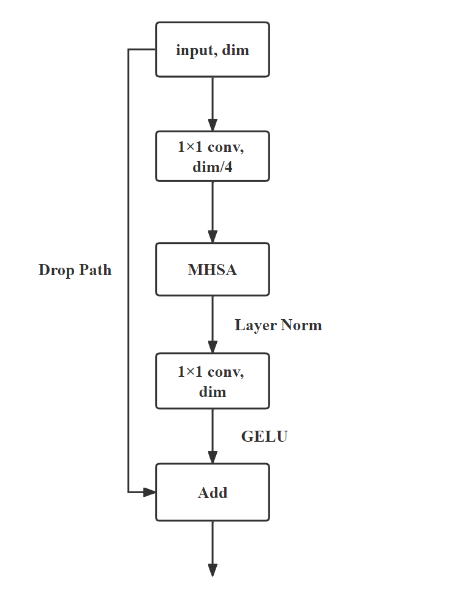

# Project1
Code for thesis. Mainly focus on how to improve the detector's performance on _multi-scale_ scenes.

This project provides 2 ways to adress thie problem: `Attention Neck` and `Residual Feature Augmentation` in FPN.

---

## AttentionNeck  
Use a pure global mulit-head self attention block to replace the depth-wise convolution in bottleneck. More etails about this design is shown blow.

The backbone structure is modified from a convnext_tiny, only the depthwise convolution in stage 4 is replaced by a AttentionNeck.




---

## Dataset
The original dataset is DOTA v1.0. The original train set will be used as train and val set. The original val set will be treated as test set.

For training, the original train set is cropped into 2 scales:  
```
subsize = 640, overlap = 50
subsize = 1280, overlap = 100
```

For evaluate, the original val set is cropped as:
```
subsize = 960, overlap = 50
```

The model is trained and evaluated on CROPPED_DOTA dataset.

About how to processing the data, refer to another project `DOTA-processing`.

---

## Usage
The label format is using VOC-style. So, first transform the annotations into `xml` file.

To set the training scheduel, go to `configure.py`, almos every training paramaters are in this script.

Run `train.py` to train the model. If train a model from very begining (do not pre-trained backbone or pre-trained model), set the `epoch` to some big value, such as 500. If use pre-trained backbone or model, `epoch` can be set to some small value to save the time, such as 300.

To evaluate the model, run `get_map.py`. The evaluateing params (such like mAP threshold) are independent from `configure.py`, please directly set them in `get_map.py`.
